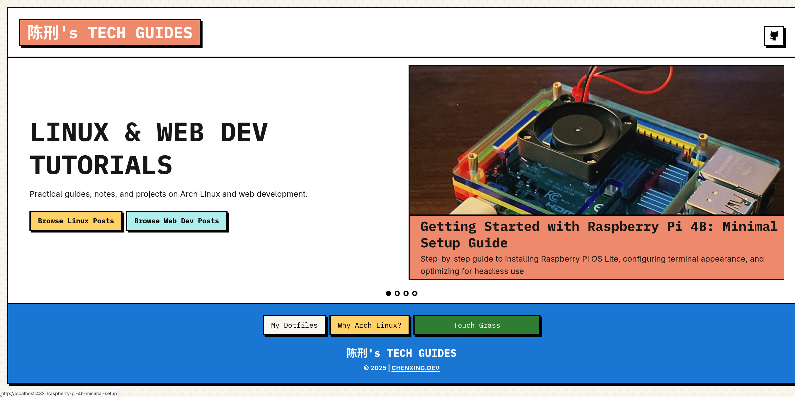

# Neobrutalism Style Blog 🚀



A minimalist-neobrutalism style blog that transforms Markdown notes into a website deployed to GitHub Pages. Built with Astro + TailwindCSS, featuring bold typography, sharp borders, and a vibrant color scheme. 

**🛠️ Tech Stack**  
[](https://astro.build)
[](https://tailwindcss.com)
[](https://pages.github.com)

## Installation ⚙️

```bash
git clone https://github.com/chenxing-dev/blog.git
cd blog
npm install
npm run dev
```

## Usage 📝

1. **Create New Posts**  
   Add Markdown files to `src/content/linux/`:
   ```markdown
   ---
   title: "Your Post Title"
   date: 2025-01-01
   description: "Brief description of your post"
   category: "terminal"  # terminal/config/desktop/etc.
   tags: ["tag1", "tag2"]
   ---
   ## Your Content Here
   ```

2. **Local Development**  
   ```bash
   npm run dev
   ```
   View at `http://localhost:4321/blog/`

3. **Build & Deploy**  
   ```bash
   npm run deploy
   ```
   Auto-publishes to `https://<username>.github.io/blog`

## Project Structure 📂

```
blog/
├── src/
│   ├── components/
│   │   ├── Header.astro
│   │   └── GithubIcon.astro
│   ├── content/
│   │   ├── linux/          # Linux-related posts
│   │   └── web/            # Web development posts
│   ├── layouts/
│   │   └── Layout.astro
│   └── pages/
│       ├── [id].astro     # Dynamic post routes
│       └── 404.astro
│       └── index.astro
│   ├── lib/
│   │   └── readTime.js    # Read time calculator
│   └── styles/
└── astro.config.mjs
```

## Deployment 🚀

1. Configure in `astro.config.mjs`:
   ```javascript
   export default defineConfig({
     site: 'https://change.this',
     base: '/'
   });
   ```
2. Push to the master branch
```bash
   git add .
   git commit -m 'changed astro config'
   git push -u origin master
   ```

## License 📄

MIT License - see [LICENSE](LICENSE)

---

**Made with 🖤 by 陈刑**